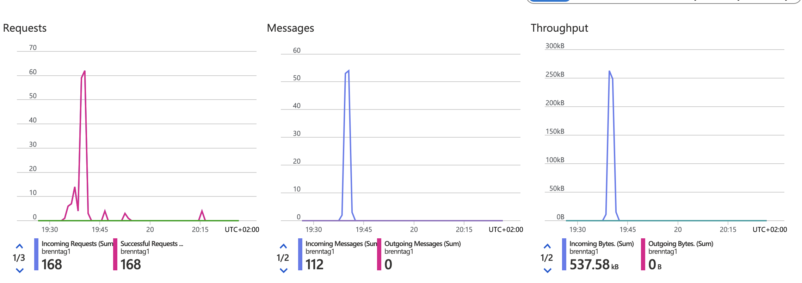
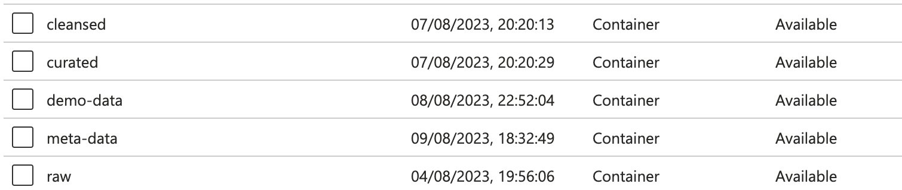
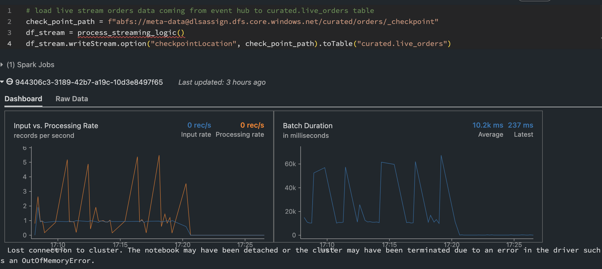
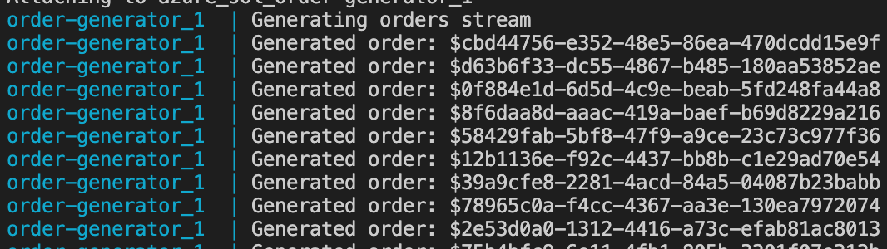
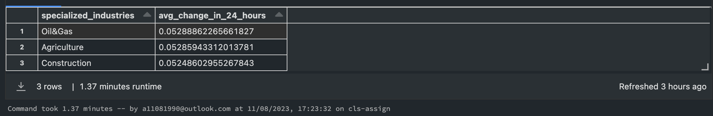

# Data Engineering Assignment

This repository contains a data engineering solution developed to answer the question: "Which top 3 industries are showing the biggest change in the last 24 hours compared to the past 30 days' average?" The solution is designed using a combination of Azure services, Python, PySpark, Docker, and Databricks to create a comprehensive and scalable data pipeline.

Table of Contents
- Objective
- Technologies and Tools
- Solution Architecture
- Data Flow
- Execution Instructions
- Results and Insights
- Conclusion

## Objective
The main objective of this assignment is to demonstrate proficiency in designing and implementing a data engineering solution that processes real-time data, applies transformations, calculates meaningful metrics, and derives valuable insights for analysis.

## Technologies Used
- Azure Services: Utilized Azure Containers, Azure Event Hub, and Azure Databricks for data storage, event streaming, and data processing.
- Python and PySpark: Leveraged Python for scripting and PySpark for distributed data processing.
- Docker: Employed Docker to containerize the data generation and event streaming processes, ensuring a consistent and reproducible environment.
- Databricks: Utilized Databricks notebooks for data transformation and analysis tasks.
- Git and GitHub: Used version control to manage the codebase and facilitate collaboration.

## Solution Architecture
- The solution architecture is designed to ensure reliability, scalability, and flexibility in processing real-time data and deriving insights. Here's a high-level overview of the architecture:

**Data Generation:**
- A Python script generates simulated real-time orders, which are sent to the Azure Event Hub (brenntag_eh) with a throughput of 1MB.

**Data Ingestion and Storage:**
- Initial data is sourced from various locations and received in the demo-data container.
- Raw data is ingested and transformed into a structured format, stored in the raw container as Parquet files. Duplicate data is detected and avoided.
Data Transformation:

**Data transformation:**
- It is performed using the CustomerDataPrep notebook.
- Cleansed data is loaded into the cleansed.customer Hive table, with metadata managed by Hive. The cleansed data is stored in the cleansed container's customer folder.
- Incremental loading ensures only new data is added, maintaining data integrity.

**Streaming Data Processing:**
- The curated.live_orders table is populated with structured and cleaned data from the Event Hub using PySpark DataFrames in Databricks.
- Data is continuously processed, ensuring data consistency and availability.

**Data Analysis:**
- A comprehensive analysis is conducted by joining cleansed.customers and curated.live_orders tables on the customer_id field.
- Metrics such as past_30_days_avg_price and change_in_24_hours are calculated.

**Final Analysis:**
- The solution identifies the top 3 industries that exhibited the most significant changes in the last 24 hours compared to the past 30 days' average.

## DataFlow
The data flow can be summarized as follows:

- Simulated orders are generated and sent to the Azure Event Hub.
- Raw data is ingested and transformed, then stored in the raw container.
- Transformed data is cleansed and loaded into the cleansed.customer Hive table.
- Cleansed data is used for analysis alongside streaming data from curated.live_orders.

## Execution Instructions
Build the Docker Image:
- **docker build . -t azure_sol:latest**

Start the Docker Compose:
- **docker-compose up**

- Real-time data begins flowing to the Azure Event Hub endpoint, initiating the entire solution's workflow.

- Once data starts flowing into the Azure Event Hub endpoint, execute the following notebooks in order:

- **DBconfig** notebook to create necessary Hive tables.
ContainerDataTransfer notebook to export data from demo-data to raw container.
- **CustomerDataPrep** notebook to transform and load data into cleansed.customer table.
- **streaming_eventhub_to_hive** notebook to stream data into PySpark DataFrame and load it into curated.live_orders table.
- **analysis** notebook to perform data analysis and identify top industries with significant changes.

## Results and Insights
The solution's analysis identifies the top 3 industries that experienced the most significant changes in the last 24 hours compared to the past 30 days' average. These insights provide valuable information for business decision-making.
